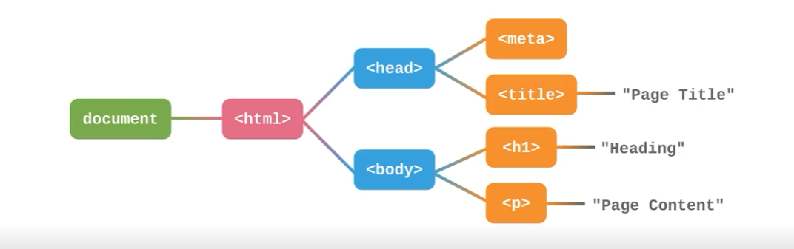

# HTML

HyperText Markup Language

超文本：

+ 图片
+ 标题
+ 表格
+ 链接

标记/标签：

```html
<h1>hello word</h1>
```

+ `<h1>` 开始标签
+ `hello world` 内容
+ `</h1>` 结束标签

```html

```

+ `src="test.jpg"` 属性和值
+ `/>` 没有内容时候，省略结束标签，在开始标签最后写一个斜杠

```html
<!doctype html> <!-- 指明 html 版本以及渲染模式，不写有显著差别 -->
<html> <!-- 根标签 -->
    <head> <!-- 头部，不会被显示 -->
        <meta charset="utf-8"> <!-- 编码 -->
        <title>页面标题</title>
    </head>
    <body> <!-- 页面内容 -->
        <h1>一级标题</h1>
        <p>段落内容</p>
    </body>
</html>
```

DOM 树 & DOM 节点：



语法：

+ 标签和属性推荐小写
+ 空标签可以不闭合
+ 属性的值推荐用双引号包裹
+ 某些属性的值可以省略，（0/1 变量），只要写了就算 1

分类

+ Flow
+ Metadata
+ Heading
+ Sectioning
+ ...

## 文本

### 链接 = `a`

参见 [MDN](https://developer.mozilla.org/zh-CN/docs/Learn/HTML/Introduction_to_HTML/Creating_hyperlinks)

```
<a href="..." > Something </a>
```

关于 URL:

scheme(http) + Host(www.bilibili.com) + Path(/bv123123) + Query(?a=1&b=2) + Hash(#test)

可以省略，会按照当前的补全。

Hash 可以定位到指定 id 的元素

#### target 属性

参见 [MDN](https://developer.mozilla.org/zh-CN/docs/Web/HTML/Element/a#attr-target)

取值：

+ `_self`：当前窗口打开
+ `_blank`：新窗口打开

### 引用

块级别的引用 `<blockquote>` : [&lt;blockquote&gt;：块级引用元素 - HTML（超文本标记语言） | MDN (mozilla.org)](https://developer.mozilla.org/zh-CN/docs/Web/HTML/Element/blockquote)

行内级别的引用 `<q>` ： [&lt;q&gt; - HTML（超文本标记语言） | MDN (mozilla.org)](https://developer.mozilla.org/zh-CN/docs/Web/HTML/Element/q)

给出出处 `<cite>` 

### 强调

斜体 `<em>` 

粗体 `<strong>`
