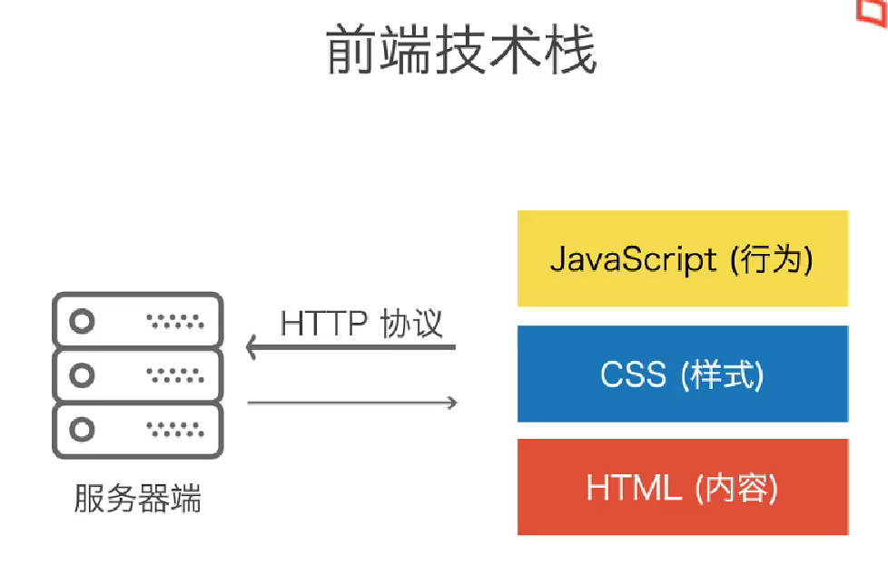
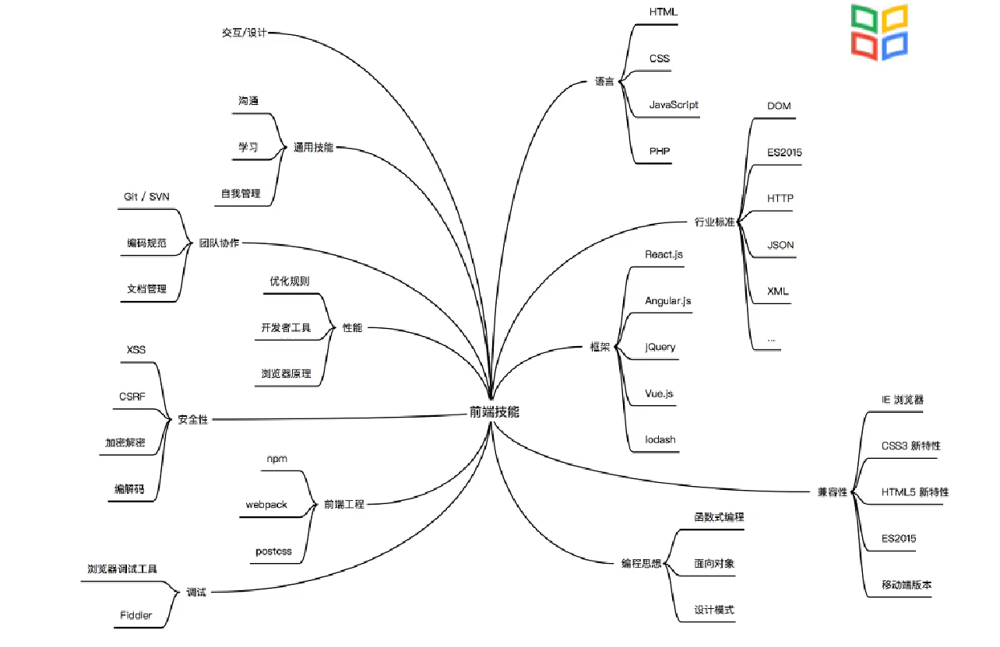
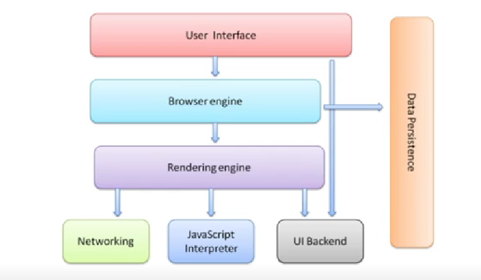

# Web 前端技术

需要关注的方面：

- 功能
- 美观
- 安全
- 无障碍
- 性能
- 体验
- 兼容

知识结构：

前端的边界：

- Nodejs
- Electron
- React Native
- WebRTC: p2p
- WebGL
- WebAssembly

编辑器：

- VSCode
- WebStorm(Jetbrains)

浏览器：

- Edge/Chrome
- Firefox
- Safari

浏览器架构：

浏览器的引擎（Engine）:

| 浏览器            | 渲染引擎 | Javascript 引擎 |
| ----------------- | -------- | --------------- |
| Internet Explorer | Trident  | JScript         |
| Edge              | EdgeHTML | Chakra          |
| Firefox           | Gecko    | SpiderMonkey    |
| Chrome            | Blink    | V8              |
| Safari            | Webkit   | Nitro           |

调试工具：

Chrome/Edge DevTools